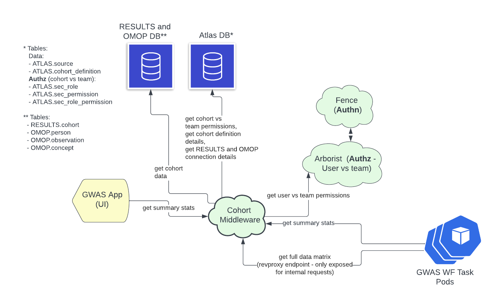

# Cohort-middleware

 [](LICENSE) [](https://travis-ci.org/uc-cdis/cohort-middleware) [](https://coveralls.io/github/uc-cdis/cohort-middleware?branch=master)

Cohort-middleware provides a set of web-services (endpoints) for:

1. providing information about cohorts to which a user has authorized access (Atlas DB cohorts as defined in Fence/Arborist?)
2. getting clinical attribute values for a given cohort (aka CONCEPT values in Atlas/OMOP jargon)
3. providing patient-level clinical attribute values matrix for use in backend workflows, like GWAS workflows (e.g. https://github.com/uc-cdis/vadc-genesis-cwl)

The cohorts and their clinical attribute values are retrieved from a
connected OHDSI/CMD/Atlas database via SQL queries.

## Overview diagram

Overview of cohort-middleware and its connected systems:

<div align="center">

</div>


## Running

Execute the following command to get help:

```
go run main.go -h
```

To just start with the default "development" settings:
```
go run main.go
```


### Config file

See example config file in `./config/` folder.

### DB schemas

The data which our code queries is currently assuming 2 separate databases.
The "atlas" schema on one database, and the "results" and "cdm" schemas
together on another DB. In practice, the databases could even be a mix from
different vendors/engines (e.g. one a "sql server" and one a "postgres").
Therefore, the code does not have queries that do a direct join between
tables in "atlas" and "results" or "atlas" and "cdm".

Below is an overview of the schemas and respective tables.


**DB Instance1**:
```sql
-- ========================================================
CREATE SCHEMA atlas;
-- ========================================================

CREATE TABLE atlas.source
CREATE TABLE atlas.source_daimon
CREATE TABLE atlas.cohort_definition
```

**DB Instance2**:

```sql
-- ========================================================
CREATE SCHEMA results;
-- ========================================================

CREATE TABLE results.COHORT
-- can we assume that the cohort_definition will also be present in results? That will make queries easier
CREATE TABLE results.COHORT_DEFINITION


-- ========================================================
CREATE SCHEMA cdm;
-- ========================================================

CREATE TABLE cdm.person
CREATE TABLE cdm.observation
CREATE TABLE cdm.concept
```


#### Setting up databases for local development

Setup the local Atlas DB by running the `init_db.sh` script in the `./tests` folder:

```
cd tests
./init_db.sh
```

**Test this setup by opening a browser and trying the following URLs**:

- http://localhost:8080/sources
- http://localhost:8080/cohortdefinitions
- http://localhost:8080/cohort/by-name/Test%20cohort1/source/by-name/results_and_cdm_DATABASE

POST request:

curl -d '{"ConceptIds":[8532,8507]}' -H "Content-Type: application/json" -X POST http://localhost:8080/concept-stats/by-source-id/1/by-cohort-id/3
